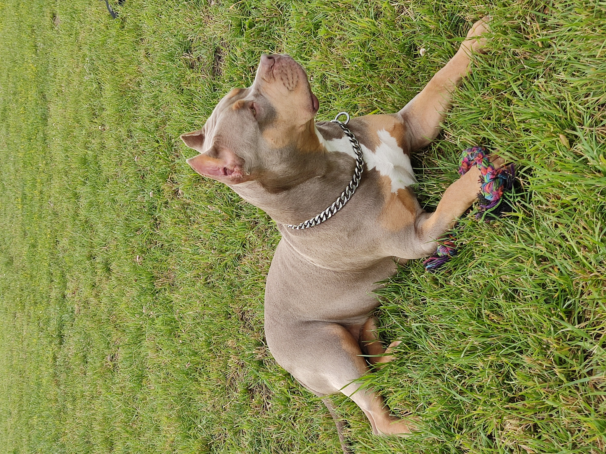

# Инструкция

Изучение команд

## Команда git init

## Команда git status

## Команда git add

### Команда git add .

## Команда git commit

### Команда git commit -m""

### Команда git commit -a -m""

## Команда git log

### Команда git log -p

## Команда git checkout

### Команда git checkout master

## Команда git diff

## Выход из режима просмотра

## Выход из редактора

## Работа с Markdown :

### **Полужирное начертание**- ставим (**) без пробелов с обеих сторон текста без пробела

### *Курсивное начертание* или _курсивное начертание_ - ставим (*) или (_) с обеих сторон текста без пробела

### ***Курсивное полужирное начертание***  - ставим (***) с обеих сторон текста без пробела

### ~~Зачеркнутый текст~~ - ставим (~~) с обеих сторон текста без пробелов

## Присоединение картинок

task

Изменения строки 49 в ветке task3

Изменили строку 51 в ветке task2

Проверка результатов слияния на строке 53

Решение конфликта после слияния на строке 53

Создаем commit для дз 2 задание 3

Конфликт разрешен

Создали удаленный репозиторий и существующий локальный привязали к нему

